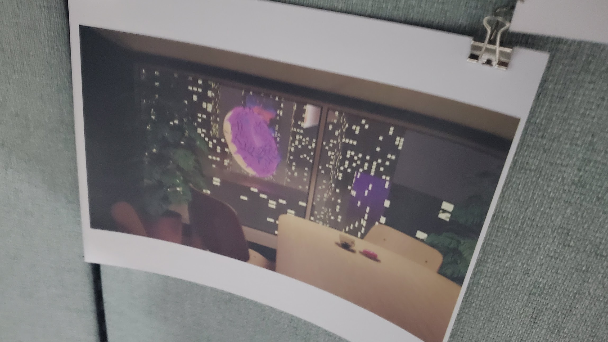
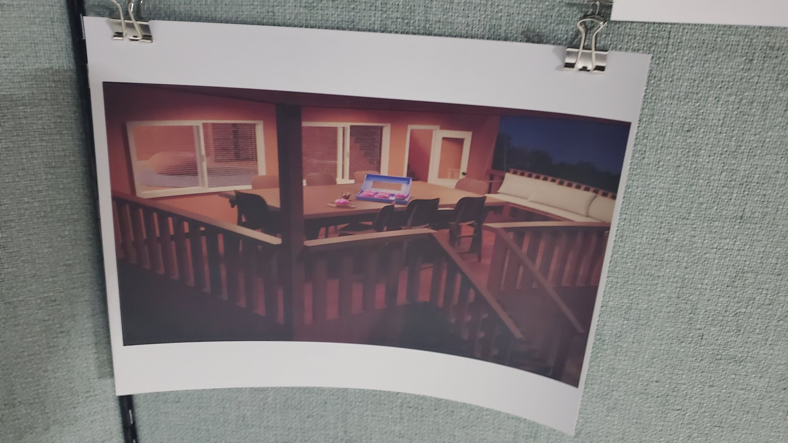
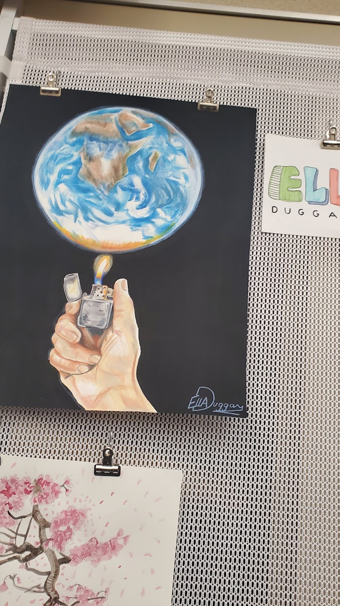
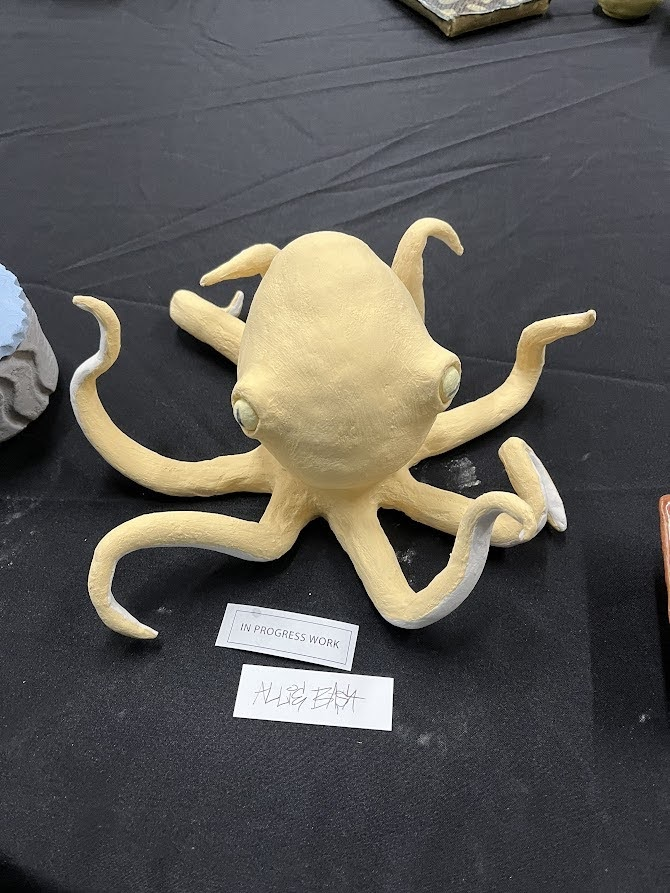
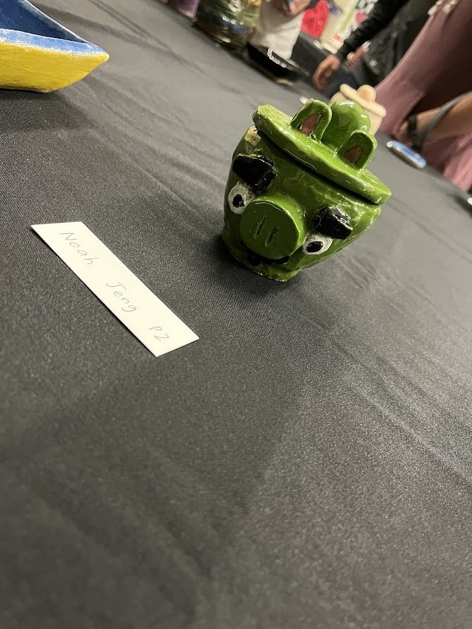

---
categories:
- markdown
description: This is my blog post about art pieces that stood out to me Night At The
  Museum
layout: post
title: Night At The Museum
toc: true

---

### 3D Animation
Here are a few pictures that impressed me from 3D Animation.

I haven't took this coure yet, but I plan to take it in the future so this was a good opportunity to see what some of the students are able to do, and gave me a bit of an incentive to take the course. 

---

### AP/Studio Art
Here is a picture of my favorite piece from AP Studio Art.

I definetly am not the most gifted when it comes to art however I am still a big fan of looking at good art pieces. Hence, I was really impressed by the quality of drawings these kids had made. Some of them looked so realistic it just blew my mind.

---

### Ceramics
Here are some pictures of artworks in Ceramics.

I'm not very familiar with how ceramics works, so it was really cool to see how students were able to create such unique shapes and also make them shiny.
